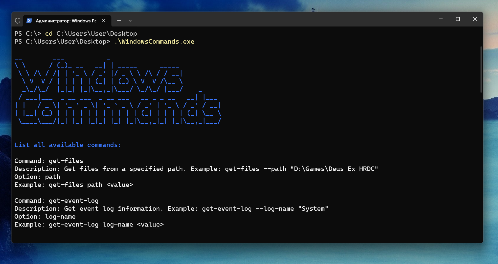

# WindowsCommands


This project is a command-line application built in C#. It provides a variety of commands for retrieving system information, managing network interfaces, and more.
This project was inspired by the [PS-Commands](https://github.com/Lifailon/PS-Commands) project on GitHub. I wanted to create a similar tool in C# that would provide similar functionality. This project is still under development.

## Features
The application currently supports the following commands:

- Get files from a specified path
- Get event log
- Get network interface stats
- Get process performance
- Get user session
- Get web certificate info
- Start TCP server
- Start UDP server
- Ping network
- Get system info
- Get memory info
- Get memory slots info
- Get CPU info
- Get driver info
- Get disk info
- Get IO info
- Get ARP table
- Get network adapter info
- Get network configuration
- Monitor network utilization
- Get temperature ***
- Get video card info
- Get Windows update info
- Get Battery information
- Clean old temporary files
- Download images from a specified URL **

** The `Download images from a specified URL` command saves the images to the `My Pictures` folder.
*** The `Get temperature` command may not work on many systems due to the hardware support

Many commands come with its own set of options that allow you to customize the command's behavior.

## Usage

1. Open a command prompt as administrator.
2. Navigate to the directory containing the utility.
3. Run the utility as a command-line argument. For example:

    ```
    .\WindowsCommands.exe
    ```
4. When you start the application, you'll see a title and an available commands.

## Future Development

This project is still under development. I plan to add more commands in the future to further enhance the functionality of the application. Stay tuned for updates!

## Contributions

We welcome contributions from the community. If you have a command you'd like to add, feel free to open a pull request.

## Author

Bohdan Harabadzhyu

## License

[MIT](https://choosealicense.com/licenses/mit/)
